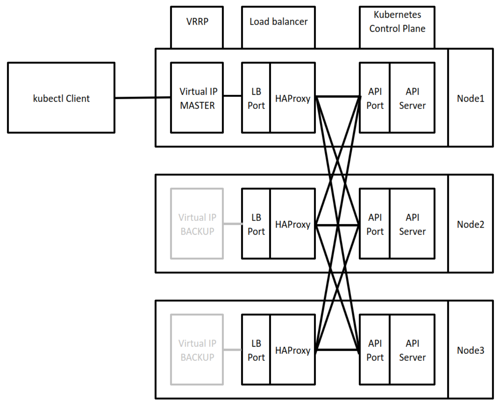

Ansible Role: ha-kubernetes
=========

Ansible role that configures a kubernetes cluster with high availability options using keepalived and HAProxy.

This role installs keepalived and HAproxy before forming a highly available kubernetes cluster.

I'm using roles from @geerlingguy to:
- install containerd as the container runtime
- install kubernetes package
- initiate a control plane node (referred to as the 'lead_controller')

The remaining control plane and worker nodes are then joined to the cluster.

Dependencies
------------

Required roles:
- geerlingguy.containerd
- geerlingguy.kubernetes

Can be installed using:
~~~
ansible-galaxy install -r requirements.yml
~~~

Python packages:
- dnspython (only when using FQDNs for ansible_host, see inventory configuration below)

~~~
pip install dnspython
~~~

Inventory configuration
-----------------------

This role requires that control plane nodes are a part of the "controllers" group and worker nodes are a part of the "workers" group.  

One control plane node is elected as leader, this node will initialise the cluster and all other nodes will join. This should be set using the "lead_controller: {{ inventory_name }}" global variable. The following example inventory file shows the node named "barry" has the lead controller.

~~~
all:
  vars:
    ansible_user: vagrant
    lead_controller: barry
  children:
    controllers:
      hosts:
        barry:
          ansible_host: 192.168.60.101
          ansible_ssh_private_key_file: .vagrant/machines/control-1/virtualbox/private_key
        robin:
          ansible_host: 192.168.60.102
          ansible_ssh_private_key_file: .vagrant/machines/control-2/virtualbox/private_key 
        maurice:
          ansible_host: 192.168.60.103
          ansible_ssh_private_key_file: .vagrant/machines/control-3/virtualbox/private_key
    workers:
      hosts:
        diana:
          ansible_host: 192.168.60.111
          ansible_ssh_private_key_file: .vagrant/machines/worker-1/virtualbox/private_key
        florence:
          ansible_host: 192.168.60.112
          ansible_ssh_private_key_file: .vagrant/machines/worker-2/virtualbox/private_key
        mary:
          ansible_host: 192.168.60.113
          ansible_ssh_private_key_file: .vagrant/machines/worker-3/virtualbox/private_key
~~~

If no lead controller is set, the alpha-numerically lowest controller will be dynamically set as the lead controller. The lead controller has no operational significance to the cluster, it is simply the node on which the cluster is intialized.

*Note:* when using FQDNs for ansible_host, dnspython package is required to resolve the IP address. This role explicitly sets a bind interface for VRRP which needs the cluster_interface to be set. 

Role Variables
--------------
~~~
node_name: "{{ ansible_hostname }}"
~~~
Set the node name for each node. By default, it uses the nodes hostname. node_name: "{{ inventory_name }}" will set the node name to the alias name defined in the inventory file.

~~~
vrrp_virtual_ip: "192.168.60.100"
~~~
Virtual IP Address used by VRRP and managed by keepalived. 

~~~
haproxy_listen_port: 8443
~~~
The port that HAProxy listens on

~~~
pod_subnet: 10.252.0.0/16
~~~
The subnet that is used to for the pod network

~~~
cni: calico
~~~
The CNI to use. Can be "calico", "flannel" or "weave"

~~~
taint_controllers: true
~~~
Sets if control plane nodes can host pods. 
- true: no pods can be scheduled to the control plane
- false: pods can be scheduled to the control plane

When transitioning betwen a taint and not taint, and pods that are already scheduled will not be removed. 

~~~
set_user_kubeconfig: true
~~~
Sets the kubeconfig for the ansible_user. The root user always has its kubeconfig set.

~~~
set_host_kubeconfig: false
~~~
When set to true, the kubeconfig file is downloaded to the ansible controller host and placed in the directory set by host_kubeconfig_dest

~~~
host_kubeconfig_dest: ~/.kube/config
~~~
The directory that the kubeconfig is downloaded to when set_host_kuneconfig is true.

Example Playbook
----------------
~~~
- name: Provision Kubernetes Cluster
  hosts: all
  become: true
  gather_facts: true
  roles:
    - role: gadgieOps.ha-kubernetes
      vars:
      - taint_controllers: true
      - set_host_kubeconfig: true
      - vrrp_virtual_ip: "10.252.1.1"
      - haproxy_listen_port: "38080"
~~~

Collaboration
-------------
Please feel free to raise issues and submit pull requests.

Notes
-----
Tested using:
- Ubuntu 20.04
- CentOS 7.9

This method of deploying a non production kubernetes environment is admitidly a heavy process. Various tools such as micro-k8s, kind, k3s may be more appropriate for lighter weight solutions.

License
-------
MIT

Author Information
------------------
Authored by gadgieOps.
